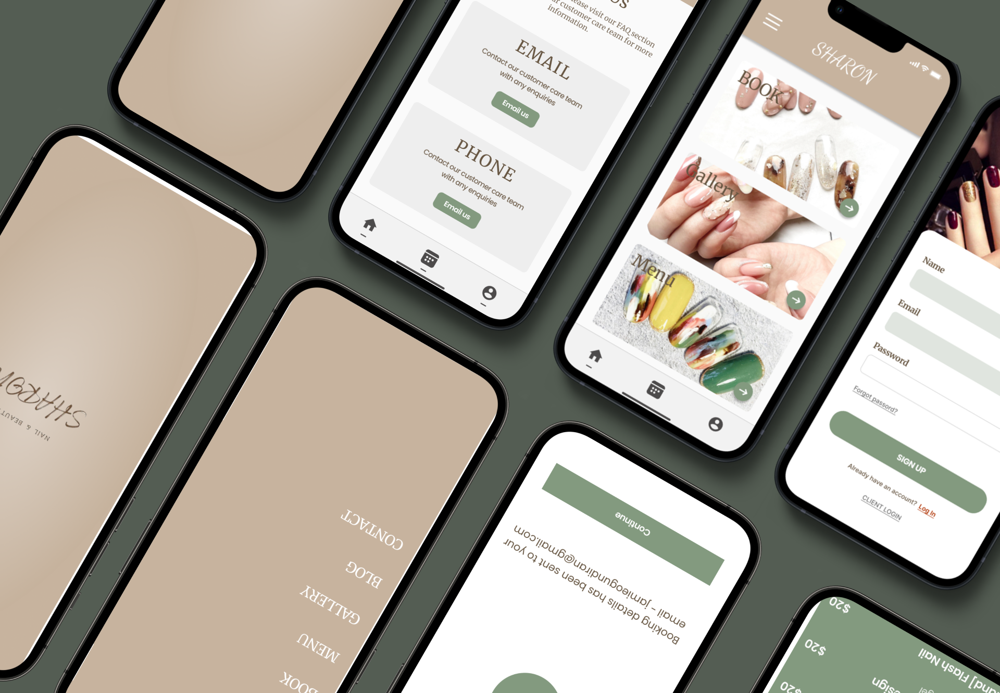

# Salon Appointment Application



## Project Overview

This Salon Appointment Application is an intuitive, user-friendly mobile app designed to streamline nail salon bookings and enhance customer experience. Built using React Native for the frontend and Firebase for backend services, the application offers robust and scalable functionality.

## Features

### Current Features

- **Appointment Scheduling:** Real-time booking functionality allowing users to schedule salon appointments conveniently.
- **Salon Statistics Dashboard:** View metrics like energy consumption rates, appointment frequency, and overall company revenue.
- **Admin Dashboard:** Simplified interface for managing appointments, monitoring salon statistics, and reviewing company revenue.
- **Social Media Integration:** Facilitates seamless connectivity to popular social platforms to enhance user engagement.
- **Geolocation Functionality:** Assists users in locating the salon with ease through built-in navigation services.

### Planned Future Enhancements
- **Online Payment Integration:** Enable users to directly pay for salon services through the app.
- **Push Notifications:** Regular appointment reminders and promotional offers sent directly to users.
- **Customer Reviews and Ratings:** Allow customers to provide feedback and ratings for services received.

## Getting Started

### Prerequisites
- Node.js installed on your computer.
- Expo Go mobile application.

### Installation and Setup

1. **Clone the Repository:**
```bash
git clone https://github.com/YourGitHubUsername/Booking-application-.git
```

2. **Navigate to the Project Directory:**
```bash
cd Booking-application-
```

3. **Install Dependencies:**
```bash
npm install
```

4. **Start the Expo Development Server:**
```bash
expo start
```

5. **Launch the Application:**
- Open the Expo Go app on your mobile device.
- Scan the QR code from your terminal or browser.

## Documentation

Detailed documentation, including features, code structure, and backend setup, can be found in the [Development Documentation (PDF)]([https://link-to-your-pdf-documentation](https://pdflink.to/sharon_booking_application_pdf/)).

## Design Process

Explore our design approach through our interactive [Figma Project](https://www.figma.com/community/file/1481094071369393115).

## License

This project is licensed under the MIT License. For more information, refer to the [LICENSE](LICENSE) file included with the project.

## Acknowledgements

Special thanks to the open-source communities and maintainers of React Native and Firebase for their invaluable resources and tools.

